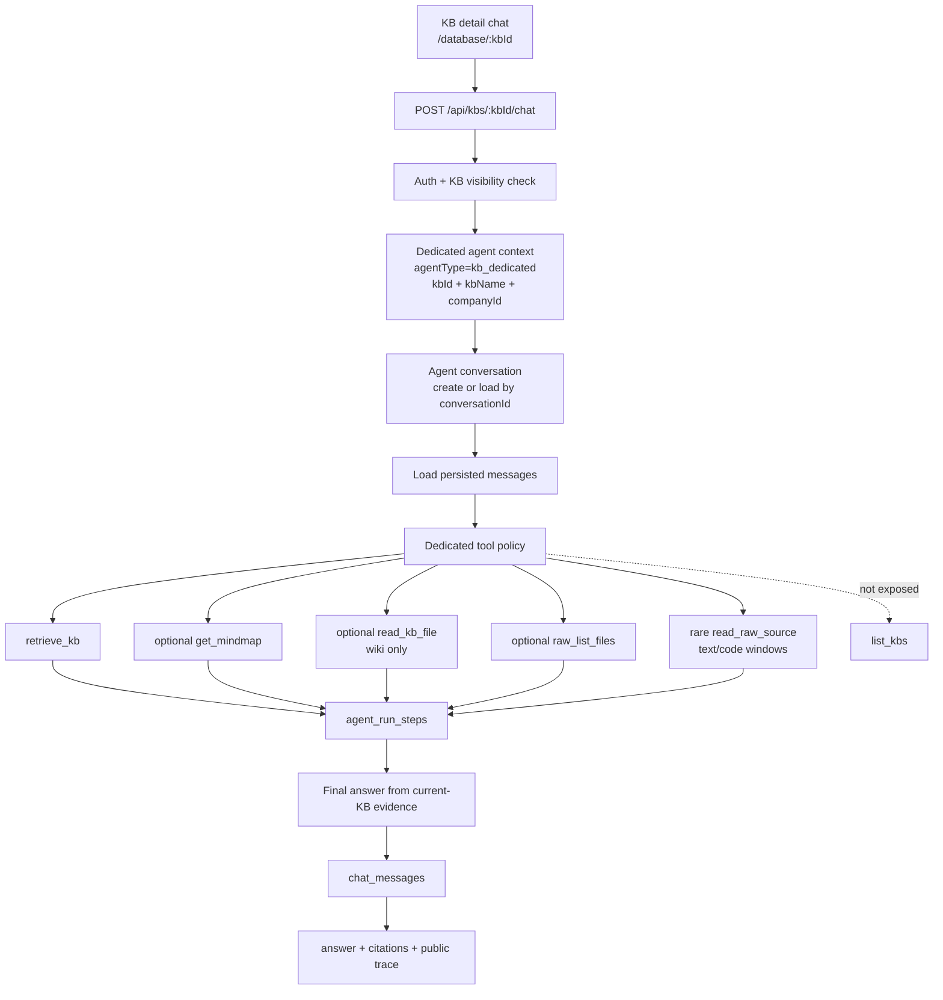
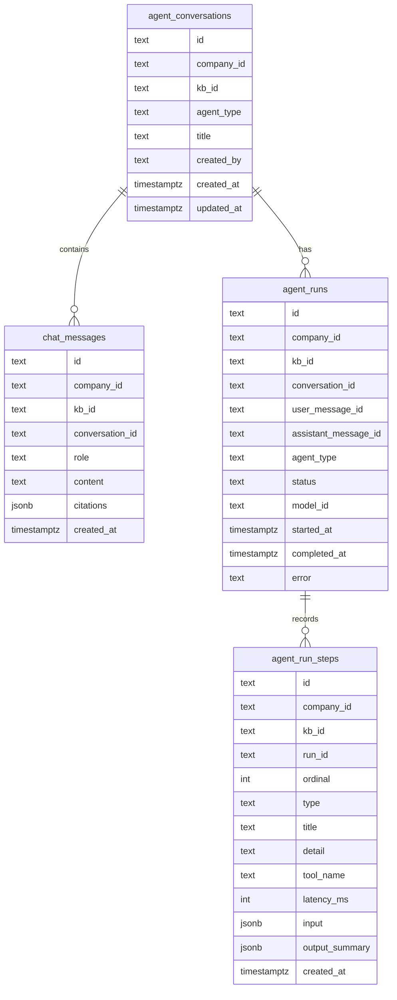

# KB Dedicated Agent Architecture

## Goal

The chat panel under `/database/:kbId` is a dedicated agent for one knowledge base. The route, auth check, tool policy, retrieval calls, history, and run records all stay scoped to that `kbId`.

This is different from the future configurable agent product:

- KB dedicated agent: current database detail page, one fixed knowledge base, no cross-KB discovery.
- Configurable agent: future admin-created agent, explicit tool and knowledge-base visibility configuration.

`list_kbs` belongs to the future configurable-agent surface. It must not appear in the current KB chat/tools experience.

## Runtime Flow



## Tool Surfaces

| Surface | Scope | Built-ins visible |
| --- | --- | --- |
| KB detail chat | One selected KB | `retrieve_kb`, `get_mindmap`, `read_kb_file`, `raw_list_files`, `read_raw_source`, eligible KB custom tools |
| KB detail tools tab | One selected KB | KB-scoped tools only; no `list_kbs` |
| Global/manual tools API | User/company context | Global discovery tools such as `list_kbs` may stay available |
| Future configurable agent | Explicit config | Config decides visible KBs and tool allowlist |

The dedicated KB agent receives the current `KnowledgeBase` object from the route. It should never discover or switch to a different KB by tool call.

Raw source access is intentionally narrow:

- `raw_list_files(parent, deep)` lists raw upload structure with a bounded recursive depth.
- `read_raw_source(path, offset, maxChars)` reads only text, markdown, or code-like raw files.
- `read_raw_source` returns `total`, `offset`, `end`, `hasMore`, and `content` so follow-up reads can page by offset.
- The dedicated agent should prefer retrieval and generated wiki evidence. It should call raw source reads only when the user explicitly asks for original text, source code, direct quotes, or the generated evidence is insufficient for a specific claim.

## Persistence Model



`chat_messages` remains the canonical transcript table. `agent_runs` and `agent_run_steps` preserve the full execution process for each assistant response: plan, tool calls, observations, errors, and answer step.

## API Shape

Dedicated chat:

```http
POST /api/kbs/:kbId/chat
```

Request:

```json
{
  "question": "Summarize the architecture",
  "conversationId": "optional existing conversation"
}
```

Response:

```json
{
  "conversationId": "conv_xxx",
  "answer": "...",
  "citations": [],
  "trace": []
}
```

History:

```http
GET /api/kbs/:kbId/conversations
GET /api/kbs/:kbId/conversations/:conversationId
```

The detail endpoint returns persisted messages and assistant-message traces so a reload can reconstruct the visible chat history without relying on frontend state.

## Implementation Rules

- Dedicated KB routes must use the existing KB visibility check before reading messages or tools.
- Tool listing for `/api/kbs/:kbId/tools` must exclude global discovery tools.
- Agent auto tools must come from a dedicated-KB surface, not a global surface.
- Every chat request creates or updates an `agent_conversations` row.
- Every user message is written before the agent run starts.
- Every tool call and observation is written to `agent_run_steps`.
- Assistant messages are linked back from `agent_runs.assistant_message_id`.
- Failed runs keep their steps and final error.
