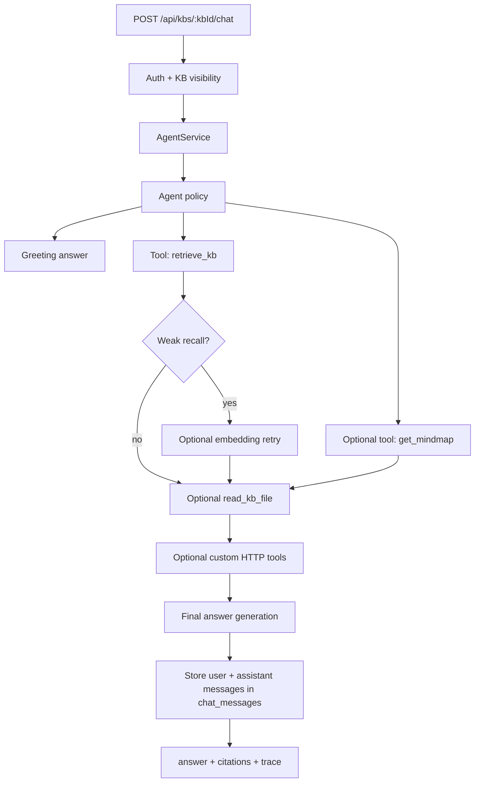

# Yuxi-style Agent and Chat Architecture

## Goal

Expose knowledge-base chat through an Agent that uses the tool registry as its action surface.

The chat endpoint is not a direct RAG prompt. It is:

1. receive a user question;
2. choose a fast or deeper evidence path;
3. call deterministic tools for evidence;
4. generate the final answer when needed;
5. return citations and a public execution trace.

## Current Main Path

The current Agent chat path is the Fastify knowledge-base API:

```http
POST /api/kbs/:kbId/chat
```

This is the path used by the browser knowledge-base experience and by the new Agent orchestration layer.

The legacy desktop local API path below is not the current Agent path:

```http
POST /api/v1/projects/{id}/chat
```

That Rust `tiny_http` endpoint belongs to the older local desktop API surface. Do not use its historical behavior to describe the current Agent chat architecture.

## Code Ownership

- `backend/src/app.ts`: route registration, auth, company membership, and knowledge-base visibility checks.
- `backend/src/agent-service.ts`: Agent orchestration, chat persistence, citations, and public trace.
- `backend/src/tool-service.ts`: deterministic tool registry used by both the Agent and the manual Tools tab.
- `backend/src/tool-config-service.ts`: persisted custom HTTP tool configuration.
- `backend/src/retrieval-service.ts`: zero-LLM retrieval core used by Search and `retrieve_kb`.
- `backend/src/graph-index-service.ts`: optional Neo4j graph recall index.

## Boundaries

- `retrieve_kb` means recall only. It does not answer the user.
- `get_mindmap` gives graph/community context when the question needs global structure.
- `read_kb_file` gives exact page evidence when snippets are not enough.
- Custom HTTP tools can be enabled for the Agent with `agentEnabled` and `triggers`.
- Retrieval tools do not call the LLM.
- Search does not call the LLM.
- The Agent may call the LLM after tool execution to compose the final answer.
- If no LLM endpoint is configured or the provider call fails, `LlmGateway` returns a deterministic fallback answer assembled from retrieved evidence.
- The response must not expose hidden chain-of-thought. User-visible thinking is a public execution trace, not private model reasoning.

## Flow



## Fast And Deep Policy

Fast path:

- short factual questions;
- exact-title or high-score recall;
- no broad graph wording.

Actions: `retrieve_kb`, then answer from snippets or top page excerpts.

Deep path:

- broad summary, architecture, relationship, comparison, why/how questions;
- weak first recall;
- evidence-heavy wording such as source, basis, detail, original text, or citation.

Actions: `retrieve_kb`, optionally `get_mindmap`, optionally embedding retry, then `read_kb_file` for top pages.

Custom tool path:

- company admins can add HTTP tools in the Tools tab;
- `agentEnabled: true` makes a custom tool eligible for the Agent;
- `triggers` decide when the Agent may call it;
- only simple required arguments (`query`, `question`, `kbId`) are auto-filled today.

## API

```http
POST /api/kbs/:kbId/chat
```

Request:

```json
{
  "question": "What are the core conclusions in this knowledge base?",
  "conversationId": "optional"
}
```

Response:

```json
{
  "conversationId": "conv_xxx",
  "answer": "...",
  "citations": [
    { "pageId": "index", "title": "Index", "path": "wiki/index.md" }
  ],
  "trace": [
    {
      "type": "tool",
      "title": "retrieve_kb",
      "detail": "Retrieved 8 candidate pages.",
      "latencyMs": 42
    }
  ]
}
```

Response semantics:

- `conversationId` is generated when omitted and reused when provided.
- `answer` is the Agent's final natural-language response.
- `citations` are derived from retrieved pages, not free-form model output.
- `trace` is a public execution trace with `plan`, `tool`, `observation`, and `answer` steps.
- The endpoint persists both user and assistant messages in `chat_messages`.

## Frontend

The knowledge-base detail page exposes a Chat experience backed by `POST /api/kbs/:kbId/chat`. It can show:

- user and assistant messages;
- answer citations;
- public execution trace, including tool calls and observations.

The Tools tab remains available for manual inspection and debugging of the same registry the Agent uses.
