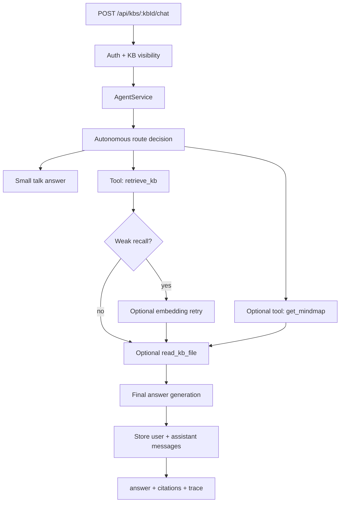

# Yuxi-style agent and chat architecture

## Goal

Expose chat again, but route every non-trivial user question through an agent that uses the tool registry as its action surface.

The chat endpoint is not a direct RAG prompt. It is:

1. receive a user question
2. let the agent choose a fast or deeper path
3. call tools for evidence
4. generate the final answer
5. return citations and a public execution trace

## Boundaries

- `retrieve_kb` means recall only. It does not answer the user.
- `get_mindmap` gives graph/community context when the question needs global structure.
- `read_kb_file` gives precise page evidence when snippets are not enough.
- Custom HTTP tools can be enabled for the agent with `agentEnabled` and `triggers`.
- The agent may call the LLM for the final answer.
- The response can expose public steps, tool calls, timing, and evidence summaries.
- The response must not expose hidden chain-of-thought. User-visible "thinking" is an execution trace, not private model reasoning.

## Flow



## Autonomous fast/deep policy

Fast path:

- short factual questions
- exact-title or high-score recall
- no broad graph wording

Actions: `retrieve_kb`, then answer from snippets or top page excerpts.

Deep path:

- broad summary, architecture, relationship, comparison, "why/how" questions
- weak first recall
- evidence-heavy wording such as "source", "basis", "detail", "原文", "依据"

Actions: `retrieve_kb`, optionally `get_mindmap`, optionally semantic retry, then `read_kb_file` for top pages.

Custom tool path:

- company admins can add HTTP tools in the `工具` tab
- `agentEnabled: true` makes a custom tool eligible for the agent
- `triggers` decide when the agent may call it
- only simple required arguments (`query`, `question`, `kbId`) are auto-filled today

## API

```http
POST /api/kbs/:kbId/chat
```

Request:

```json
{
  "question": "这个知识库的核心结论是什么？",
  "conversationId": "optional"
}
```

Response:

```json
{
  "conversationId": "conv_xxx",
  "answer": "...",
  "citations": [
    { "pageId": "index", "title": "Index", "path": "wiki/index.md" }
  ],
  "trace": [
    {
      "type": "tool",
      "title": "retrieve_kb",
      "detail": "召回 8 个候选页面",
      "latencyMs": 42
    }
  ]
}
```

## Frontend

The knowledge-base detail page exposes a `Chat` tab. It shows:

- user and assistant messages
- answer citations
- public execution trace, including tool calls and observations

The `Tools` tab remains available for manual inspection and debugging.
