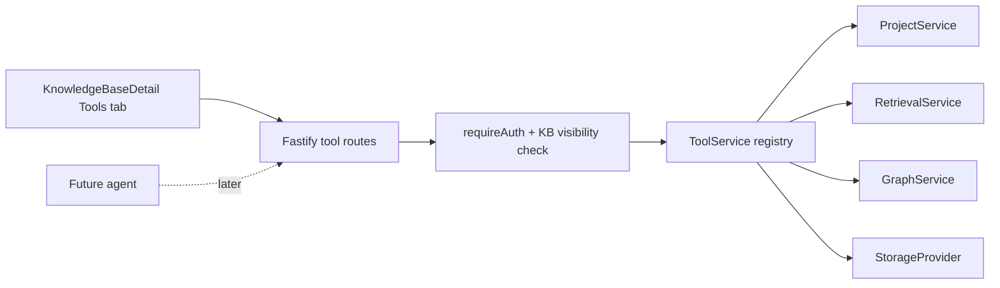

# Yuxi-style tool surface

## Goal

Build the tool layer first. The agent and chat layer will be added only after this tool surface is confirmed.

The tool layer gives a future agent a small set of deterministic, fast, read-only actions:

- discover visible knowledge bases
- retrieve evidence from one knowledge base with graph-first retrieval
- inspect the knowledge graph as a compact mindmap
- list raw/wiki files
- read a capped text file

No tool calls the LLM. No tool writes data. No tool depends on chat state.

## Architecture



## Backend

`backend/src/tool-service.ts` owns tool metadata and execution.

Each tool has:

- `name`
- `displayName`
- `description`
- `category`
- `scope`: `global` or `knowledge_base`
- `readOnly`
- JSON-like parameter schema
- handler

Routes:

- `GET /api/tools`
- `POST /api/tools/:toolName/run`
- `GET /api/tools/config`
- `POST /api/tools/custom`
- `DELETE /api/tools/custom/:toolName`
- `GET /api/kbs/:kbId/tools`
- `POST /api/kbs/:kbId/tools/:toolName/run`

KB-scoped routes reuse the existing knowledge-base permission check, so `creator_only` and company isolation are preserved.
Tool configuration routes require company admin permissions because custom tools may call external HTTP services.

## Built-in tools

| Tool | Scope | Purpose |
| --- | --- | --- |
| `list_kbs` | global | List visible knowledge bases. |
| `retrieve_kb` | knowledge_base | Run fast graph-first retrieval. |
| `get_mindmap` | knowledge_base | Return communities, strong edges, and a markdown mindmap. |
| `list_kb_files` | knowledge_base | List `raw/` or `wiki/` storage trees. |
| `read_kb_file` | knowledge_base | Read a capped text file from `raw/` or `wiki/`. |

## Custom tools

Custom tools are persisted in `config/tools.json` under the server data directory. The first supported extension type is an HTTP tool:

```json
{
  "name": "external_search",
  "displayName": "External search",
  "description": "Call an external HTTP service when this tool is needed.",
  "category": "external",
  "scope": "knowledge_base",
  "readOnly": true,
  "enabled": true,
  "agentEnabled": false,
  "triggers": ["external_search"],
  "parameters": {
    "type": "object",
    "properties": {
      "query": { "type": "string", "description": "Question or search phrase." }
    },
    "required": ["query"],
    "additionalProperties": false
  },
  "http": {
    "url": "https://example.com/tool",
    "method": "POST",
    "headers": {},
    "timeoutMs": 10000
  }
}
```

When `agentEnabled` is true, the agent may call the custom tool automatically if the user question matches one of its `triggers` and the required arguments can be filled from the question.

## Frontend

The knowledge-base detail page now has a `工具` tab. It lists the available tools, shows their schema, lets the user edit JSON arguments, displays JSON output, and lets company admins save or delete custom HTTP tools.

This is only a verification surface. It is not chat and it does not contain agent routing logic.

## Next phase

After confirmation, the agent can use the same `ToolService` registry as its action set. The agent should decide whether to call `retrieve_kb`, `get_mindmap`, or `read_kb_file` based on task complexity and latency budget, but the tools themselves remain deterministic and fast.
